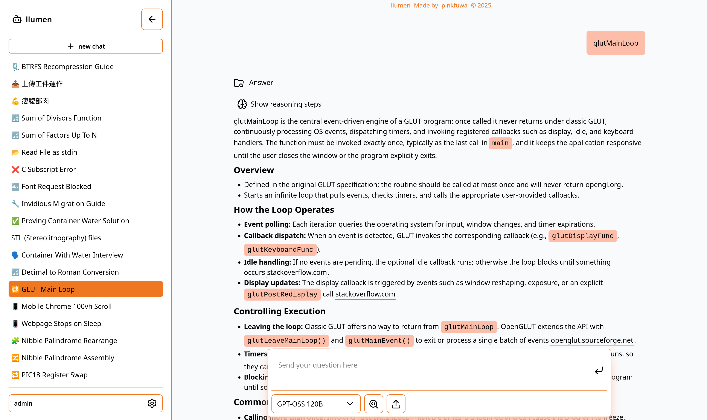
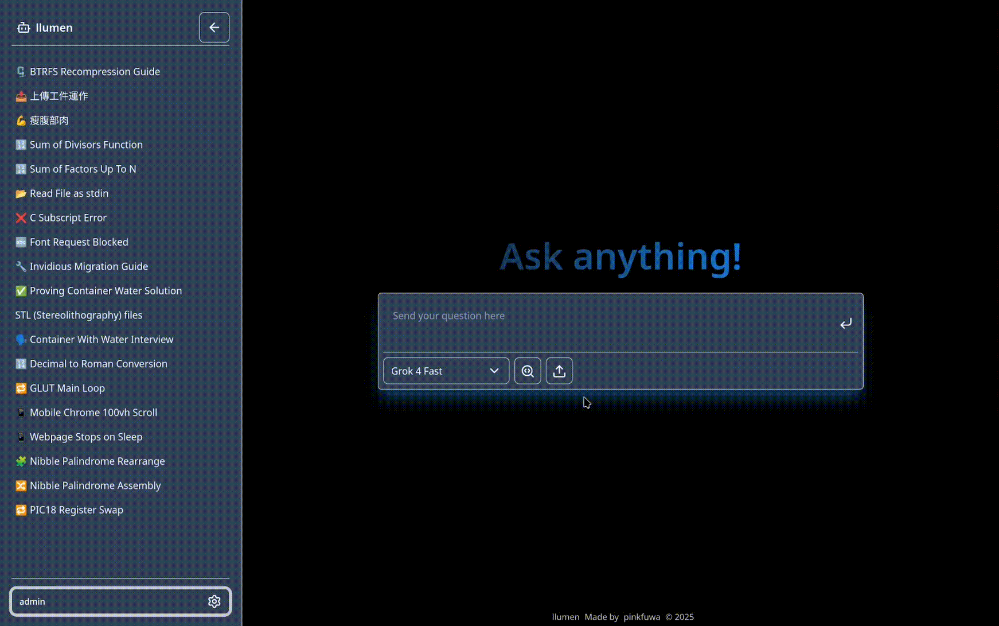

<div align="center">
  

  # llumen

  ### :zap: a lightweight, performant LLM chat application with effortless setup :rocket:

  [](https://www.mozilla.org/en-US/MPL/2.0/)
  [](https://rustup.rs/)
  [](https://github.com/pinkfuwa/llumen/actions/workflows/docker-nightly.yml)
  [](https://github.com/pinkfuwa/llumen/actions/workflows/build-binaries.yml)

</div>

llumen is a lightweight, self-hostable LLM chat application (frontend + backend) that aims to provide an out-of-the-box experience for self-hosting users.

Its design goal is simplicity: you only need a single **OpenRouter** API key to use LLM features — no separate keys for OCR, search, embeddings, image generation, or other services.

## :question: Why choose llumen?

- :handshake: We provide windows executable, docker image, linux binary
- :ship: Single API key requirement (OpenRouter) for model calls.
- :rocket: starting time < 1s, memory usage < 128MB
- :blue_book: Markdown rendering with code and math support.
- :mag: Multiple chat modes (normal, web-search-enabled, deep-research :brain:).

## :star2: Screenshots





## :point_right: Quickstart

> [!IMPORTANT]
> The default account is `admin`, password is `P@88w0rd`

### :whale: Docker (Recommended)

- The repository includes a multi-stage `Dockerfile` that builds the frontend and the backend and produces a small image that serves static files and runs the server.
- Example: build and run the container (binds port 80 by default).

```bash
docker run -it --rm \
  -e API_KEY="<YOUR_OPENROUTER_API_KEY>" \
  -p 80:80 \
  -v "$(pwd)/data:/data" \
  ghcr.io/pinkfuwa/llumen:latest
```
```
06:46:48.654Z INFO | Using endpoint https://openrouter.ai/api/v1/chat/completions for completions
06:46:48.675Z INFO | Listening on http://127.0.0.1:8001
```

### :package: Without docker

> [!TIP]
> Prebuild-binary is not up to dated, it only built on per-release basis

We also provided prebuild binary, download it and extract from [release](https://github.com/pinkfuwa/llumen/releases).

## :key: Environment variables

- `API_KEY` (required) — OpenRouter or equivalent provider API key.
- `API_BASE` — openai compatible api url. Default: `https://openrouter.ai/api`
- `DATABASE_URL` — database connection string. Default in Docker: `sqlite://data/db.sqlite?mode=rwc`.
- `BLOB_URL` — path for [redb](https://www.redb.org/) object storage. Default in Docker: `/data/blobs.redb`.
- `BIND_ADDR` — address the backend binds to (default in Docker: `0.0.0.0:80`).

## :book: Where to look for more documentation

- Development and build-from-source steps and other developer-focused docs were moved to `./docs/overview.md`
- User guide at `./docs/user.md`
