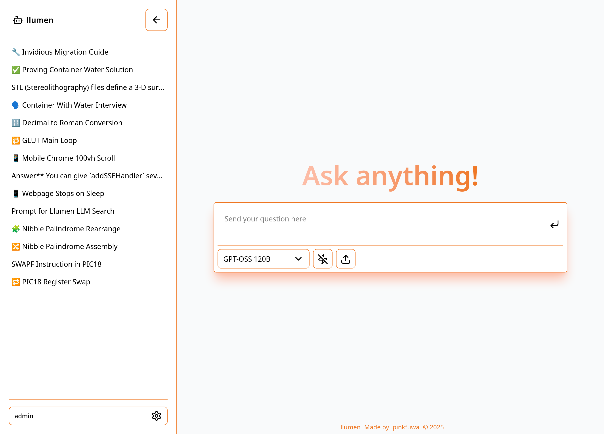

# llumen

llumen is a lightweight, self-hostable LLM chat application (frontend + backend) that aims to provide an out-of-the-box experience for self-hosting users.

Its design goal is simplicity: you only need a single OpenRouter API key to use LLM features — no separate keys for OCR, embeddings, image generation, or other services.

## Highlights

- Single API key requirement (OpenRouter) for model calls.
- Very fast and high quality UI
- Markdown rendering with code and math support.
- Multiple chat modes (normal, web-search-enabled).
- Deep-research and agentic modes (WIP :construction: ).

## Screenshots



TODO: video comparison

## Quickstart

> [!TIP]
> Use [reasoning-proxy](https://github.com/Eason0729/reasoning-proxy) to unlock advance feature with normal openai endpoint

### Docker (Recommended)

- The repository includes a multi-stage `Dockerfile` that builds the frontend and the backend and produces a small image that serves static files and runs the server.
- Example: build and run the container (binds port 80 by default).

```bash
docker run -it --rm \
  -e API_KEY="<YOUR_OPENROUTER_API_KEY>" \
  -p 80:80 \
  -v "$(pwd)/data:/data" \
  ghcr.io/pinkfuwa/llumen:latest
```

### Without docker

> [!TIP]
> Prebuild-binary is not up to dated, it only built on per-release basis

We Also provided prebuild binary, download it and extract.

## Environment variables

- `API_KEY` (required) — OpenRouter or equivalent provider API key.
- `DATABASE_URL` — database connection string. Default in Docker: `sqlite://data/db.sqlite?mode=rwc`.
- `BLOB_URL` — path for [redb](https://www.redb.org/) object storage. Default in Docker: `/data/blobs.redb`.
- `BIND_ADDR` — address the backend binds to (default in Docker: `0.0.0.0:80`).

## Where to look for more documentation

- Development and build-from-source steps, advanced type generation and other developer-focused docs were moved to `DEV.md`. If you want to build locally or contribute code, read `DEV.md` first.
- Backend source: `backend/` (Rust).
- Frontend source: `frontend/` (SvelteKit).
