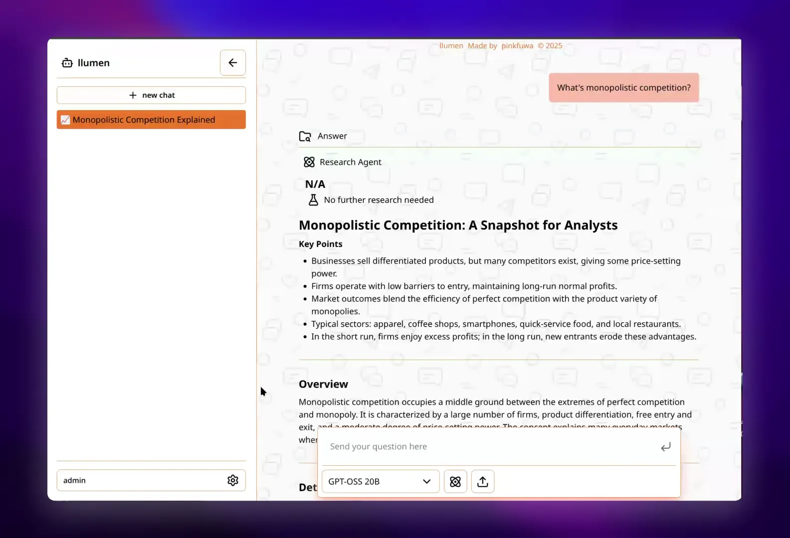

<div align="center">
  

  # Llumen

  [](https://www.mozilla.org/en-US/MPL/2.0/)
  [](https://github.com/pinkfuwa/llumen/actions/workflows/docker-nightly.yml)
  [](https://github.com/pinkfuwa/llumen/actions/workflows/check.yml)
  
</div>

<div align="center">
  
  [](./README.md)
  [](./README_zh-TW.md)
  [](./README_zh-CN.md)
</div>

---

## 為什麼選擇 Llumen？

**大多數自託管介面是為伺服器打造的，而非個人裝置。** 它們功能強大，但往往需要大量資源和數小時的設定。

Llumen 走出了一條不同的路：**保有隱私，卻不複雜**。您獲得真正需要的功能，並針對一般硬體(Raspberry Pi、舊筆電、小型 VPS)進行最佳化，同時保留商業產品的大部分功能。

|  | 隱私 | 效能 | 設定 |
| :--- | :--- | :--- | :--- |
| **商業產品** (ChatGPT) | ❌ 僅限雲端 | ✅ 高 | ✅ 零設定 |
| **典型自託管** (Open WebUI) | ✅ 本地 | ✅ 高 | ❌ 地獄設定 |
| **llumen** | ✅ 本地 | ⚖️ 剛剛好 | ✅ 零設定 |

## 特色

| 特色 | 您將獲得 |
| :--- | :--- |
| 速度 | 毫秒級冷啟動，即時串流 |
| 聊天模式 | 一般對話、網路搜尋，以及深度研究(Agent) |
| 豐富媒體 | PDF 上傳、LaTeX 渲染、圖片生成 |
| 通用 API | 任何相容 OpenAI Server（OpenRouter、本地模型等） |
| 極小佔用 | ~17MB 執行檔，<128MB 記憶體使用 |

[](https://github.com/user-attachments/assets/4d46e649-bd33-4850-af2b-59527cc11618)

## 快速開始

> **預設登入：** `admin` / `P@88w0rd`

### Docker (30 秒快速安裝)

```bash
docker run -it --rm \
  -e API_KEY="<YOUR_OPENROUTER_KEY>" \
  -p 80:80 \
  -v "$(pwd)/data:/data" \
  ghcr.io/pinkfuwa/llumen:latest
```

就這樣。不需要設定檔。不需要 Python 依賴。

**想嘗鮮最新功能？** 使用 `ghcr.io/pinkfuwa/llumen:nightly`

請參閱 [./docs/sample](./docs/sample) 查看 docker-compose 範例。

### 原生執行檔

從 [Releases](https://github.com/pinkfuwa/llumen/releases) 下載 Windows/Linux 版本（包含 arm 架構）。

## 設定 (選填)

| 變數 | 描述 | 預設值 |
| :--- | :--- | :--- |
| `API_KEY` | OpenRouter/OpenAI API 金鑰 | *必填* |
| `API_BASE` | 自訂 API Endpoint | `https://openrouter.ai/api` |
| `DATA_PATH` | 儲存資料夾 | `.` |
| `BIND_ADDR` | 網路 Socket | `0.0.0.0:80` |

## 文件

📚 **[查看完整文件](./docs)** - 使用者和開發者完整指南

- **[快速開始](./docs/quickstart.mdx)** - 30 秒快速安裝指南
- **[使用者指南](./docs/user)** - 安裝、設定和功能說明
- **[開發者文件](./docs/developer)** - 架構、貢獻指南和 API 參考

> 文件使用 [Mintlify](https://mintlify.com) 構建。本地預覽：
> ```bash
> cd docs
> npx mintlify dev
> ```

<div align="center">
  Built with ❤️ by pinkfuwa. Keep it simple, keep it fast.
</div>
